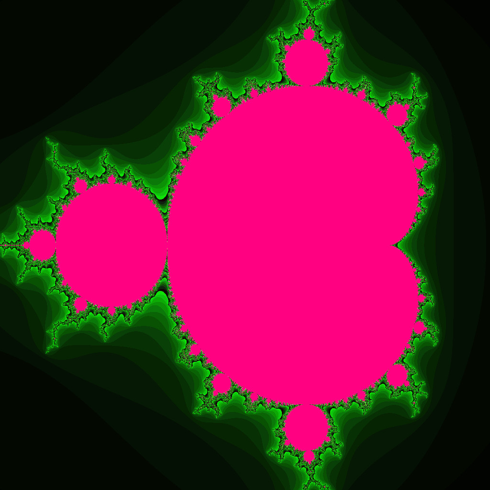

 

Fractals
================

A program capable of generating various fractals. Currently, only the Mandelbrot set with the simple escape time algorithm is supported.

Screenshot
================

About
------------------

Author: `Daniel Sebastian Iliescu, http://dansil.net`  
License: `MIT License (MIT), http://opensource.org/licenses/MIT`  

Requirements
------------------

C++14 conforming compiler.

Limitations
------------------

Extremely slow performance with std::abs( std::complex< double > ) on MSVC. Changing the standard function to manually compute the absolute value of a complex number (std::sqrt( real * real + imag * imag )) improves performance by a factor of nearly 40.